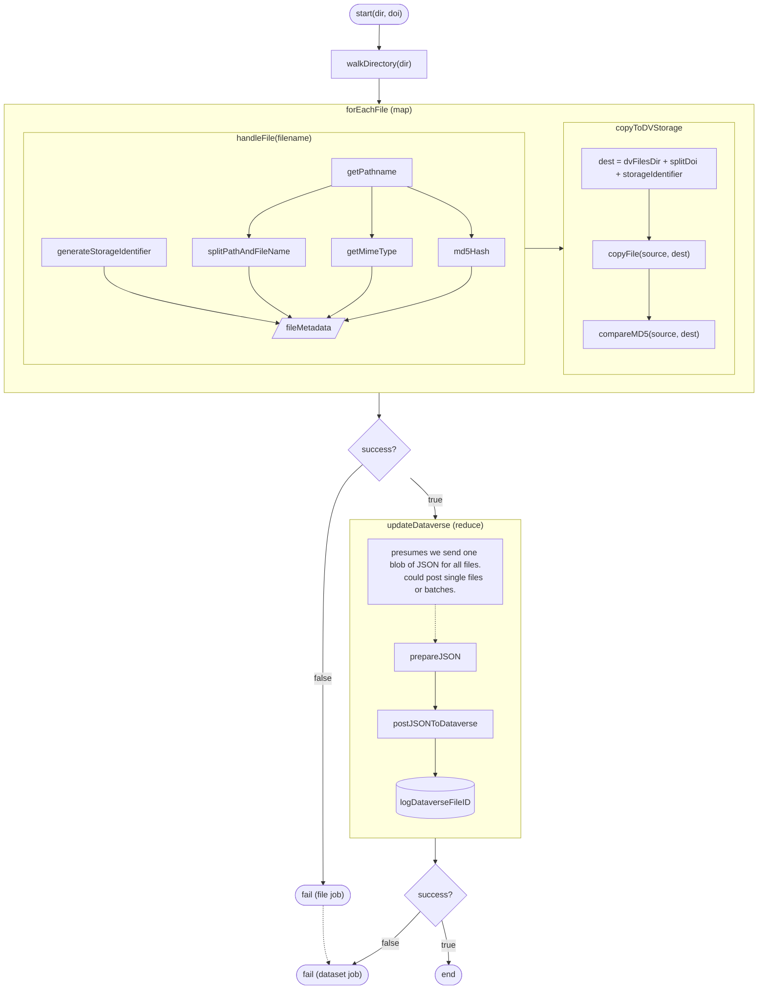

# deo-volente

`deo-volente` is a bunch of scripts and utility code for loading data into dataverse.

## job structure



## large file workaround, mk ii

for files that fail because of timeouts related to size. this requires `dataverse.files.<id>.upload-out-of-band=true` to be set (see [Dataverse documentation](https://guides.dataverse.org/en/latest/installation/config.html#file-storage)).

for each file in a batch:

* generate a storageIdentifier for the file
* upload the file to that storageIdentifier in the correct Dataverse `files` subdirectory (i.e. `files/$PERSISTENT_IDENTIFIER`)
* create a json blob like so:

```json
{
    "directoryLabel":"${relativePathInDatset}",
    "storageIdentifier":"file://${storageIdentifier}",
    "fileName":"${fileName.ext}",
    "mimeType":"${mime/type}",
    "description": "",
    "md5Hash": "${checksum}",
}
```

then, when you have a batch:

* make an array of all the json objects
* POST to "$SERVER_URL/api/datasets/:persistentId/addFiles?persistentId=$PERSISTENT_IDENTIFIER", with formdata "jsonData=$JSON_DATA"

# later

* sidekiq is a better infrastucture